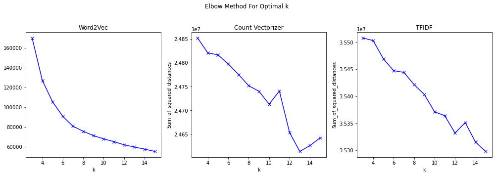
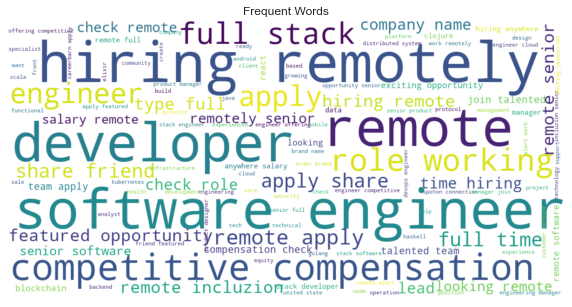
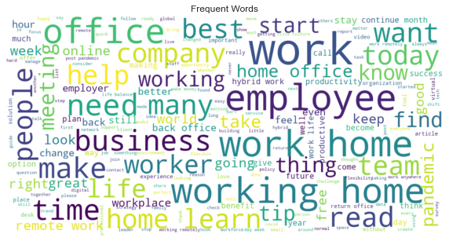
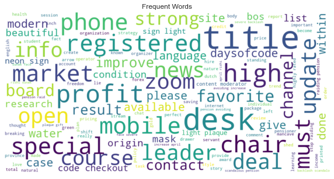
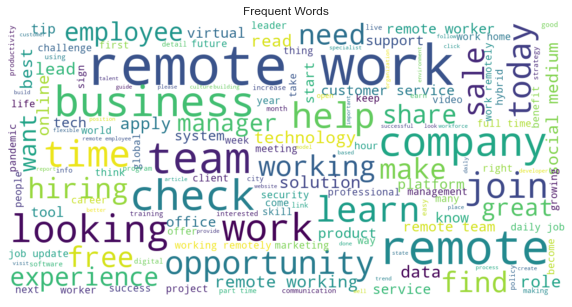

# **Problem Statement**

* Even though many companies had allowed their staff to work remotely before the COVID-19 pandemic hit the world, it became the new norm after that. As the pandemic spread, forcing the world to go into lockdown, business organizations were left with no other option than to switch to online working. As a result, there had been a drastic increase in the number of remote workers, lately.After a year-and-a-half long hiatus, many offices are opening. Most companies are asking that employees return on a hybrid basis, meaning they come into the office at least some of the time. But what exactly that will look like is uncertain.
* Since the begining of pandemic,to address the people's eagerness and to express their views, the trend of people has moved very fast towards social media platforms. Twitter has emerged as one of the most popular platforms among those. 
* Hence, to understand people's view on whether they are  comfortable with Work from home or they want to come back to offices , I considered analyzing the worldwide  twitter data.
* This project aims to study `#workfromhome` and `#remotework` related tweets to find out the opinions expressed by people.

# **Summary**

## Data Cleaning 
* Renamed the columns.
* Column order was changed.
* Retweets and duplicate tweets were removed.
* Using regex usernames, URLs, special characters, numbers, punctuations, hashtags in tweets were removed.
* Stop words were removed, Words in tweets were lemmatized and stored in a new column 'cleaned_tweets'.
* Sentiment of the tweets was detected using Vader Sentiment Analyzer and the results were stored in a new column 'polarity'.
* Location of the users were modified by replacing the places with countries the place belongs to using geonamescache and country_converter.
* Missing values were removed.
* "tweet_posted_on" which was in object format was converted to date time.
## Data Visualization
* Line plot was used to analyze the tweeting activity over the weekdays.
* Pie-chart and counterplot were used to visualize the polarity counts.
* Bar plot was used to visualize the most tweeted 10 countries and to check polarity distribution of these countries used Countplot.
* Hourly Distribution of Tweets was plotted using Distplot.
* To visualize most frequent hashtags apart from `#workfromhome`   and `#remotework` bar chart was plotted.
* Word Cloud was used to identify the most frequent words in each cluster.
## Data Modeling
* To vectorize the data Word2Vec, Count Vectorizer, and TFIDF were used.
* Words which were repeated 100 times in the dataset were used to build a corpus for Word2Vec.
* Elbow method was used to find the optimal 'n_clusters' for K-means clustering.
* Elbow method was used on Word2Vec data frame, Count Vectorized data frame, and TFIDF data frame.
* Word2Vec plot looked like an arm compared to the other two and had an elbow at 4, therefore k-means clustering was performed on the word2vec data by specifying n_clusters as 4.

* To evaluate the quality of clusters generated using word2vec data, the Silhouette score was calculated which was '0.35'.

## Packages
   * Tweepy
   * Country_converter
   * geonamescache
   * Wordcloud
   
## Outside Research
* [WFH backlash builds](https://www.linkedin.com/news/story/wfh-backlash-builds-from-bosses-5498634/)
* [Blind App Survey](https://www.forbes.com/sites/jackkelly/2021/05/21/survey-asks-employees-at-top-us-companies-if-theyd-give-up-30000-to-work-from-home-the-answers-may-surprise-you/?sh=190963de330f)
* [Top Twitter Trends: What Countries Are Most Active? Who's Most Popular?](https://www.forbes.com/sites/victorlipman/2014/05/24/top-twitter-trends-what-countries-are-most-active-whos-most-popular/?sh=7557e6f56652)
* [Sentiment analysis on the impact of coronavirus in social life using the BERT model](https://link.springer.com/article/10.1007/s13278-021-00737-z)
* [28 Need-To-Know Remote Work Statistics of 2021](https://review42.com/resources/remote-work-statistics/)
* [Companies that make people return to the office will lose employees](https://www.vox.com/recode/22583285/companies-remote-work-home-office-tsedal-neeley-harvard)

# Data

* The data was extracted from  Twitter API through Tweepy from July 11, 2021, to July 26, 2021.
* Most recent and popular tweets from `#workfromhome`   and `#remotework` were taken to conduct the analysis.
* Raw data collected from Twitter were  6 separate .csv files , all those were concatenate into a single .csv file.

## **Data Dictionary**
|        Feature        |   Type  |   Dataset  |                         Description                        |
|:---------------------:|:-------:|:----------:|:----------------------------------------------------------:|
|        tweet_id       | integer | twitter_df |                     unique id of tweet                     |
|    tweet_posted_on    |  object | twitter_df |           date and time when the tweet was posted          |
|         tweets        |  object | twitter_df |                      text of the tweet                     |
|     cleaned_tweets    |  object | twitter_df |                 text of the tweet after NLP                |
|     user_location     |  object | twitter_df |        location of the user mentioned in the profile       |
| user_location_cleaned |  object | twitter_df | location after replacing them with country user belongs to |
|        polarity       |  object | twitter_df |                   sentiment of the tweet                   |
# **Findings**
### Cluster - 1 : Remote job openings in IT sector 
Tweets in this cluster were about : 
* Job openings for 'python developer','data analyst', 'cloud infrastructure engineer','block chain developer','Dotnet developer','block chain developer','full stack developer' in US,UK,Canada,Japan,Norway,Philippines,India,Switzerland.
* Job openings for 'Director' and 'Architect' level in the US.\

### Cluster - 2 : Impact of work from home on remote workers
Tweets in this cluster were about : 
* How mental health has been affected during pandemics and tips to maintain mental health.
* Impact of work from home on work-life balance and tips to maintain work-life balance.
* Survey on people's experience working from home, work model preference.
* What employees think the future of the workplace will look like and how remote work is becoming new normal.
* Discussion about Apple's recent decision to open offices by September and the response from employees on this.
* How employers can use hybrid work flexibility to attract talent and challenges with a hybrid work model.
* People sharing their experience working from home like how they were reluctant with the idea of work from home initially and how they got adapted to it.\

### Cluster - 3 : Classified ads on home office setup accessories
Tweets in this cluster were about : 
* Deals to buy desks, chairs, desktop organizers, masks.
* Concern of people over the rise of covid cases 
* Job openings for a project manager with Saas/mobile background and Teacher in the USA.
* Job openings for Nurse, teacher, Content Moderator from the UK.
* job opening for Telesales agent from Canada.\

### Cluster - 4 : Remote job openings in Non-IT and tips on how to manage remote jobs 
Tweets in this cluster were about : 
* Job openings in Sales/Salesforce/B2B Sales in US,UK,Canada,India,Kenya,Mexico.
* Software tools to enhance work from home experience, work productivity tools to boost productivity.
* Tips on how to negotiate remote salary, managing long-term remote work, interview remote team candidates, remote project management.
* Job openings as Customer Service Representative/Advisor in US and UK.
* Technology trends.
* Trends of work model and reasons.\

# **Next Steps**
* To conduct an online survey on remote work to get information on people's preferences, challenges with work from home, help employees are expecting from the employer use the survey results along with Twitter data to analyze people's views.
* Collect more Twitter data.
* Using a trained sentiment analysis dataset and use Twitter data as test data to predict the sentiment of tweets. Compare and see if the results would vary between a trained dataset and a BERT sentiment analyzer.